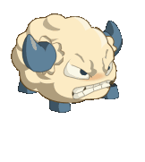

# Dofus-mini

Hi! I'm a junior developer who's trying to get better at coding every day through various personal projects. Dofus is a game that holds a special place in my life, and for this reason I've decided to pay tribute to it by trying to recode the game in a very minimalist way and according to my own style. Additionally, I’ve set myself the challenge of coding this game solely using the React library. I hope you'll enjoy it as much as I do!

Since Dofus is originally a French game, this one will also be entirely in French. An English translation will likely come in a future update.

## What to do in Dofus-mini

The game is simply a combat simulation between an Iop-class character and a "Bouftou" monster. You can move around the field, attack and try to win against the wild Bouftou that threatens you.

The game consists only of a home screen and a battle between the player and a Bouftou. You have two spells at your disposal:

- Pression (deals between 15 and 25 damage points to the enemy) 
- Compulsion (increases the damage points of the Pression spell by 6 to 11) 

More spells might be added later if I feel like it.

Be careful not to get caught by the Bouftou, as it will deal serious damage to you if it catches you!
The Bouftou only has one attack:

- Morsure du Bouftou (deals 25 to 35 damage points to the player)

There are plenty of music tracks available in Dofus-mini, so feel free to restart a game to discover them all!

## Useful Quality Of Life tips

If no sound is audible on the game, you'll probably need to enable sounds on your browser.

# Where to find Dofus-mini

You can find the application directly by following this link: https://dofus-mini.vercel.app/
